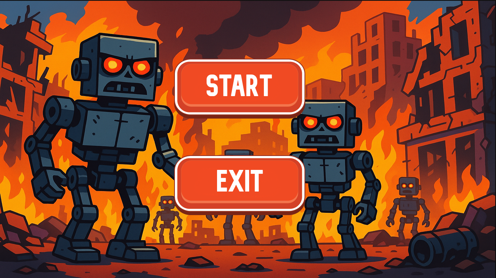
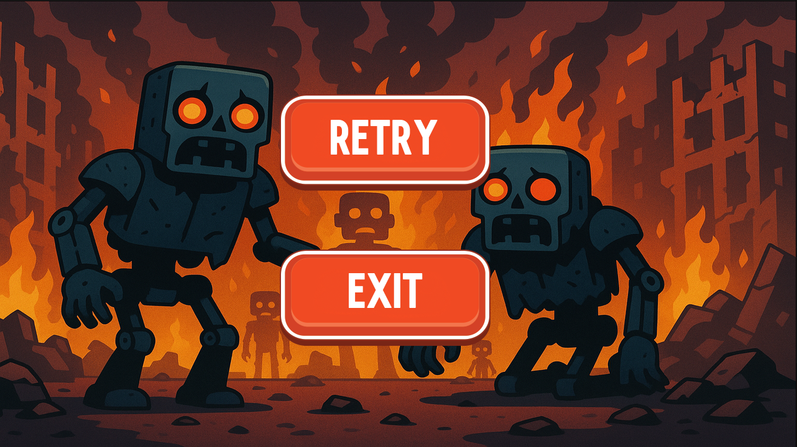
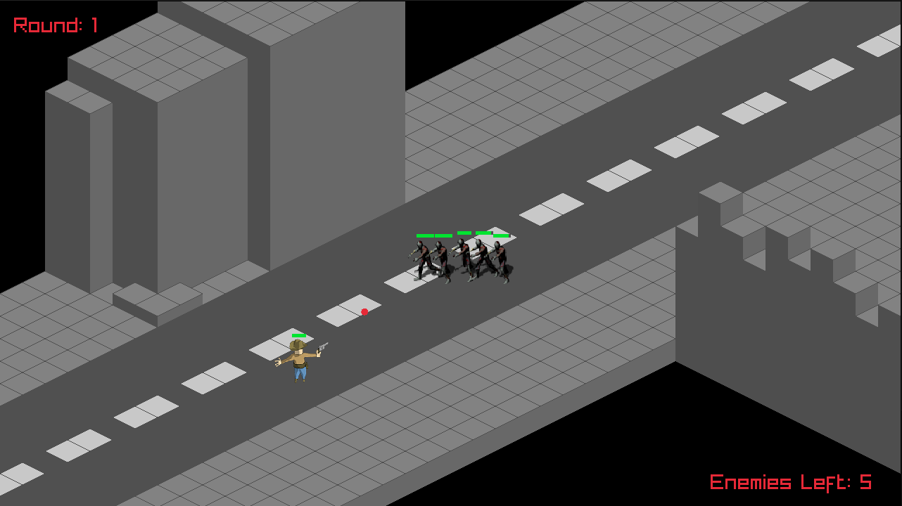
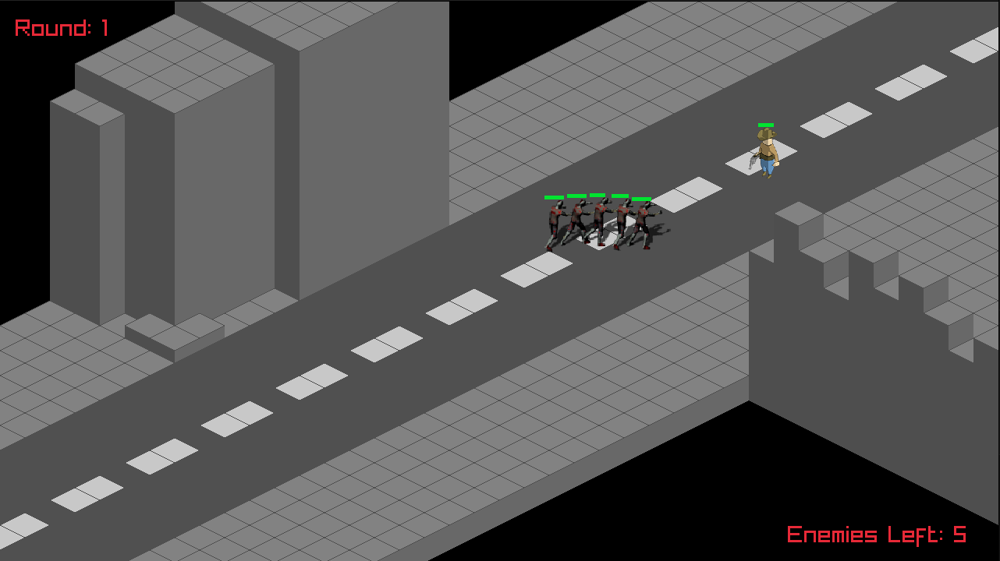

# 🤠 Last Sheriff

**Last Sheriff** is an isometric survival game where you play as the last cowboy standing in a deserted town overrun by the undead. With each passing round, more zombies appear, becoming faster and stronger. Equipped with only your revolver and grit, you must survive as long as you can in the heart of the rotten West.

---

## 👤 Developer

- Joaquin Aquino - [GitHub Profile](https://github.com/Aquino-Joaquin)

---

## 🎮 Game Description

In *Last Sheriff*, the player takes control of a lone cowboy who must defend a ghost town from waves of increasingly powerful zombies. The game features an isometric map made of tiles and a round-based enemy spawning system that scales difficulty over time.

---

## 💡 Features

- Isometric tile-based map with border tiles  
- Player movement and shooting mechanics with smooth animations for the main character  
- Animated zombies with various movement 
- Wave-based zombie spawning with increasing difficulty  
- Health and damage system for enemies  
- Modular code structure using C++ classes  

---

## 🛠️ Technologies Used

- C++  
- Raylib  
- Git & GitHub  

---

## 📸 Screenshots

  
 




---
## 🎥 Video References
- The following videos were used as references or inspiration during development:
[Animate sprite](https://www.youtube.com/watch?v=VFOIMeEePW4&list=PPSV)
[Shooting mechanics and game structure](https://www.youtube.com/watch?v=TGo3Oxdpr5o&list=PPSV)
[Buttons](https://www.youtube.com/watch?v=0Ct9ZWEUm7M&list=PPSV)
[Collision](https://www.youtube.com/watch?v=q5Y5u1c7qR0&list=PPSV)

## 🚀 How to Run

1. Clone the repository:

```bash
git clone https://github.com/joaquinaquino/last-sheriff.git
cd last-sheriff

## ⚙️ Setup and Build Instructions

This project was started using the [Raylib-Quickstart](https://github.com/RobLoach/raylib-quickstart) template, a cross-platform starter for Raylib projects.

### Supported Platforms
- Windows  
- Linux  
- MacOS  

### Quickstart Instructions

**For all platforms using VSCode:**

1. Download or clone the Raylib-Quickstart template.  
2. Rename the folder to `last-sheriff`.  
3. Open the folder in VSCode.  
4. Run the build task with `CTRL+SHIFT+B` or press `F5`.  
5. The project should build and run successfully.  

---

**Windows (MinGW-W64):**

1. Double-click the `build-MinGW-W64.bat` file.  
2. Open a terminal in the project folder.  
3. Run `make`.  
4. You are ready to go.  

> Make sure you have a modern version of MinGW-W64, preferably from [W64devkit](https://github.com/skeeto/w64devkit/releases), or installed with the Raylib installer. Add the path `C:\raylib\w64devkit\bin` to your environment variables.

---

**Windows (Visual Studio):**

1. Run `build-VisualStudio2022.bat`.  
2. Open the generated `.sln` file in Visual Studio.  
3. Build and run your game.  

---

**Linux:**

```bash
cd build
./premake5 gmake2
cd ..
make
